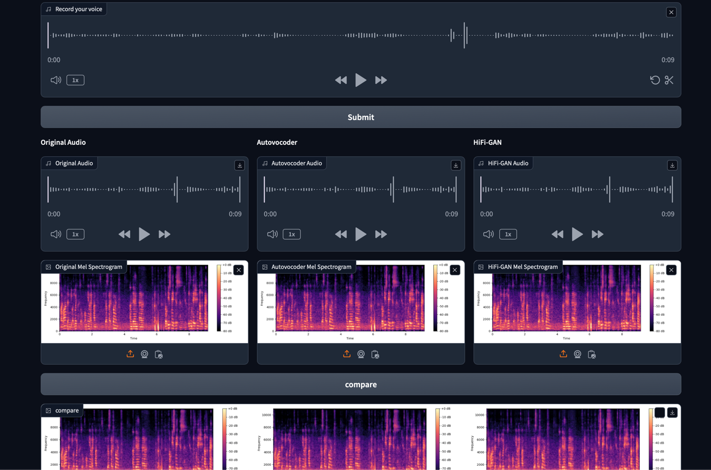

# Deep Learning Project Lab

## Team Name: **XYZ**

## Team Members:

- Member 1: Zhou Hanbo BTGY7K
- Member 2: Yang Deyu E44MLP
- Member 3: Xia Xihang BX7F0X

## Introduction

Neural vocoders have become indispensable in modern text-to-speech (TTS) systems, functioning as the final step in
converting intermediate acoustic representations into high-fidelity speech waveforms. Recent advancements in neural
vocoder architectures, such as HiFi-GAN and AutoVocoder, have significantly improved the perceptual quality and
efficiency of synthesized speech. However, challenges remain in ensuring robustness to speaker variability,
environmental noise, and computational efficiency, particularly when synthesizing speech from diverse, multi-speaker
datasets.

This project focuses on improving the AutoVocoder, a neural vocoder architecture that leverages automated techniques for
generating high-quality audio waveforms. By enhancing AutoVocoder’s ability to generalize across both single-speaker and
multi-speaker datasets, this study aims to address critical factors such as robustness to varying speaker
characteristics, noise resilience, and real-time synthesis efficiency. Through comprehensive experimentation with key
parameters and architecture modifications, the project will evaluate the

## Data Source and Download Instructions

### 1. The LJ Speech Dataset

#### Download Data

```bash
cd DataSet
wget http://data.keithito.com/data/speech/LJSpeech-1.1.tar.bz2
tar -xjf LJSpeech-1.1.tar.bz2
```

### 2. VCTK Dataset

#### Download Data

```bash
cd DataSet
wget https://datashare.ed.ac.uk/bitstream/handle/10283/2651/VCTK-Corpus.zip
unzip VCTK-Corpus.zip
```

### HiFi-GAN code

```bash
cd Code
git clone https://github.com/jik876/hifi-gan.git
```

### AutoVocoder code

```bash
cd Code
git clone https://github.com/hcy71o/AutoVocoder.git
```

## 3. Explanation:

```
Deep Learning Project Lab
├── Code
│   ├── AutoVocoder               code for AutoVocoder
│   ├── DataExploration           code for data exploration and visualization
│   └── hifi-gan                  code for HiFi-GAN
├── DataSet
│   ├── LJSpeech-1.1              LJSpeech Dataset
│   └── VCTK-Corpus               VCTK Dataset
├── Dockerfiles
│   ├── Dockerfile-hifi           Dockerfile for HiFi-GAN
│   └── Dockerfile-auto           Dockerfile for AutoVocoder
└── README.md                     Project overview and instructions
```

## 4. How to run:

### 1. run on the local machine

#### run hifi-gan

```bash
cd Code/hifi-gan
pip install -r requirements.txt
python train.py --config config_v1.json --input_wavs_dir ../DataSet/LJSpeech-1.1/wavs --input_training_file ../DataSet/LJSpeech-1.1/training.txt --input_validation_file ../DataSet/LJSpeech-1.1/validation.txt
```

#### run AutoVocoder

```bash
cd Code/AutoVocoder
pip install -r requirements.txt
python train.py --config config.json --input_wavs_dir ../DataSet/LJSpeech-1.1/wavs --input_training_file ../DataSet/LJSpeech-1.1/training.txt --input_validation_file ../DataSet/LJSpeech-1.1/validation.txt
```

### 2. run on the docker container

#### run hifi-gan

```bash
docker build -t hifi-gan -f Dockerfiles/Dockerfile-hifi .

docker run --gpus all -it -p 6006:6006 -v /your-path/cp_hifigan:/workspace/hifi-gan/cp_hifigan hifi-gan-gpu
```

#### run AutoVocoder

```bash
docker build -t auto-vocoder -f Dockerfiles/Dockerfile-auto .

docker run --gpus all -it -p 6006:6006 -v /your-path/cp_autovocoder:/workspace/auto-vocoder/cp_autovocoder auto-vocoder-gpu
```

## 5. Data exploration and visualization

```bash
cd Code/DataExploration
python data_exploration.py
```

1. Calculate and count the number and average, minimum, and maximum durations of all audio files.
2. Plot an audio waveform graph to show how the signal changes over time.
3. Plot a spectrogram to show the frequency of the audio over time.
4. plot a mel spectrogram to show the frequency of the audio over time.

## 6. Training example
[train example](Code/DataExploration/train.ipynb)

## 7. Evaluation example
[evaluation example](Code/DataExploration/evaluation.ipynb)

## 8. Frontend
You can run the frontend by running the following command:

```bash
py /Code/DataExploration/frontend.py
```

Then you can open the browser and enter the address: http://localhost:7860/

Trying to record and clicking on the SUBMIT button will visualise the result after HIFI-gan and autovocoder reasoning, including the AUDIO FILE and the MEL graph. And click compare to see the results of the three images side by side.


## 9. PPT file
[PPT file](DL_presentation.pptx)


